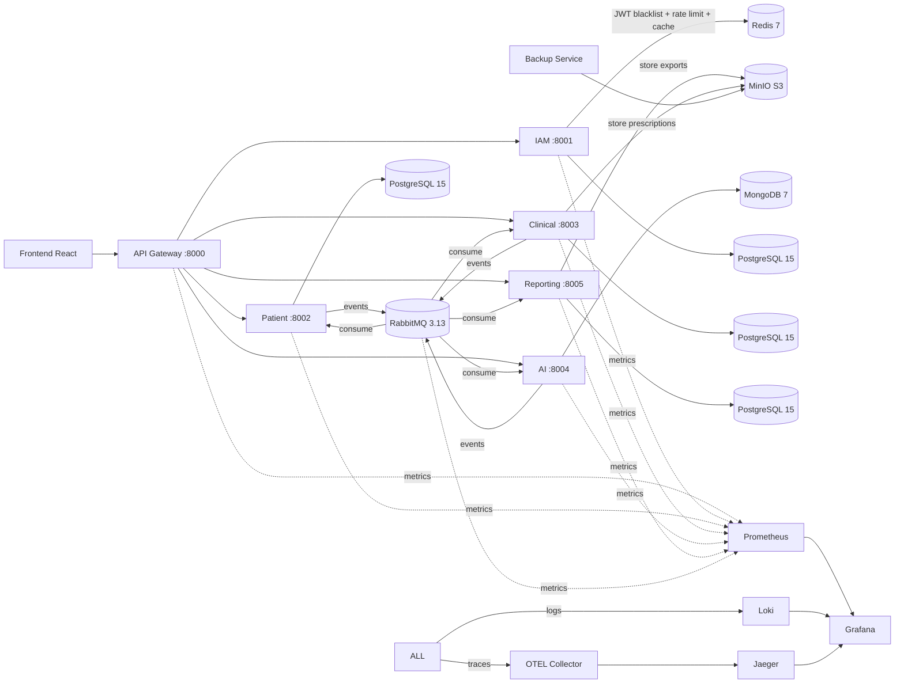

# Representação da Arquitetura de Software

**Data:** 20 de julho de 2026  
**Versão:** 1.2.0

Este documento consolida a arquitetura utilizada no **PROMPTUARIO** com base na implementação real do workspace.

---

## 1. Visão Geral

A solução adota uma arquitetura distribuída orientada a serviços, com separação por contexto de negócio e comunicação síncrona e assíncrona entre componentes.

### Características principais

- Microservices com responsabilidade delimitada por domínio (6 serviços)
- API Gateway como ponto único de entrada (JWT, rate limiting, circuit breaker, cache)
- JWT para autenticação e autorização com RBAC (4 roles)
- Database per service (4× PostgreSQL + 1× MongoDB)
- Comunicação orientada a eventos com RabbitMQ (topic exchanges + DLX)
- Processamento assíncrono para análises (AI) e relatórios (Celery workers)
- Observabilidade distribuída: Prometheus, Grafana, Loki, Jaeger, Alertmanager
- Infraestrutura containerizada com Docker Compose (20+ serviços)
- CI/CD via GitHub Actions (lint, testes, build Docker, deploy automático)

---

## 2. Estilo Arquitetural

| Camada | Papel |
|--------|-------|
| **Apresentação** | Frontend React 18 + TypeScript + Tailwind consumindo o Gateway |
| **Borda** | API Gateway com autenticação JWT, rate limiting (Redis), circuit breaker, cache GET e roteamento |
| **Domínio** | 6 microserviços por contexto funcional (IAM, Patient, Clinical, AI, Reporting, Gateway) |
| **Persistência** | Banco dedicado por serviço (PostgreSQL 15 ou MongoDB 7) |
| **Mensageria** | RabbitMQ 3.13 para eventos assíncronos com Dead Letter Queue |
| **Processamento** | Celery workers + Celery Beat para tarefas demoradas e agendadas |
| **Armazenamento** | MinIO (S3-compatible) para prescrições, relatórios e backups |
| **Observabilidade** | Prometheus, Grafana, Loki, Jaeger/Tempo, OpenTelemetry Collector, Alertmanager |
| **CI/CD** | GitHub Actions com matrix builds por serviço, push para GHCR e deploy SSH |

---

## 3. Mapa de Serviços

| Serviço | Porta Host | Porta Container | Responsabilidade | Banco |
|---------|-----------|----------------|------------------|-------|
| **Gateway** | 8000 | 8000 | Entrada única, JWT validation, rate limiting, circuit breaker, cache GET, proxy reverso, health aggregation | Stateless (Redis) |
| **IAM** | 8001 | 8000 | Autenticação (login, OAuth2 Google, 2FA), refresh/logout, CRUD usuários, RBAC | PostgreSQL (iam_db) |
| **Patient** | 8002 | 8000 | Pacientes, dados demográficos, alergias, vacinas, medicações, anonimização LGPD | PostgreSQL (patient_db) |
| **Clinical** | 8003 | 8000 | Agendamentos, slots, prontuários (histórico imutável), prescrições (PDF), exames | PostgreSQL (clinical_db) |
| **Clinical Worker** | - | - | Geração assíncrona de PDF de prescrições (Celery) | - |
| **AI** | 8004 | 8000 | Análises clínicas assíncronas (drug interaction, symptoms, summary) com LLM | MongoDB (ai_db) |
| **Reporting** | 8005 | 8000 | Relatórios (CSV/JSON/PDF), dashboards, exportações, webhooks | PostgreSQL (reporting_db) |
| **Reporting Worker** | - | - | Processamento assíncrono de relatórios (Celery) | - |
| **Reporting Beat** | - | - | Agendamento automático de relatórios (Celery Beat) | - |
| **Backup Service** | - | - | Backup automatizado dos bancos para MinIO | - |

---

## 4. Fluxo de Comunicação

### Leitura do fluxo

- O **frontend** nunca acessa os serviços internos diretamente; tudo passa pelo Gateway.
- O **Gateway** valida JWT (com blacklist Redis), aplica rate limiting (300/min auth, 30/min anon, 120/min API Key), circuit breaker (3 falhas → open 30s), cache GET (TTL 60s com Gzip) e encaminha para o serviço correto com headers de contexto (X-User-Id, X-User-Role, X-User-Email).
- Serviços de domínio persistem dados em **bancos próprios** (database per service).
- Eventos de negócio seguem para o **RabbitMQ** para comunicação assíncrona e redução de acoplamento.
- Workers **Celery** processam tarefas demoradas (geração de PDF, exportação de relatórios).
- **Celery Beat** agendamento automático de relatórios periódicos.
- A **observabilidade** coleta métricas (Prometheus), logs (Loki) e traces (Jaeger/OTEL) de todos os serviços.

---

## 5. Padrões de Projeto Aplicados

- **API Gateway Pattern** — Ponto único de entrada com cross-cutting concerns
- **Database per Service** — Isolamento de dados por domínio
- **Event-Driven Architecture** — RabbitMQ com topic exchanges e DLX
- **CQRS-inspired** — Projections para relatórios (DailyStats) e read-models (patient projections)
- **Clean Architecture** — Separação em api / domain / infrastructure nos serviços
- **Repository Pattern** — Abstração de persistência
- **Async Task Processing** — Celery para AI e Reporting
- **Circuit Breaker Pattern** — Proteção contra falhas em cascata no Gateway
- **Health Checks** — Por serviço + agregação no Gateway (/healthz/services)

---

## 6. Dependências Entre Serviços

| Origem | Destino | Tipo | Motivo |
|--------|---------|------|--------|
| Gateway | IAM | Síncrono (REST) | Validação de tokens via shared middleware |
| Patient | Clinical | Síncrono (REST) | Dados do paciente para agendamentos |
| Clinical | AI | Evento (RabbitMQ) | Solicitação automática de análise ao criar prontuário |
| Clinical | Reporting | Evento (RabbitMQ) | Atualização de métricas operacionais |
| AI | Reporting | Evento (RabbitMQ) | Resultados analíticos para relatórios |
| IAM | Patient | Evento (RabbitMQ) | Sincronização de desativação de usuário |
| IAM | Clinical | Evento (RabbitMQ) | Auto-cancelamento de consultas |
| Todos | Observabilidade | Métricas/Logs/Traces | Prometheus, Loki, Jaeger |

---

## 7. Infraestrutura de Suporte

| Componente | Versão | Função |
|------------|--------|--------|
| PostgreSQL | 15-alpine | Persistência relacional (4 bancos: IAM, Patient, Clinical, Reporting) |
| MongoDB | 7 | Persistência documental do AI Service |
| Redis | 7-alpine | Cache GET, blacklist JWT, rate limiting, Celery broker (3 databases) |
| RabbitMQ | 3.13-management | Mensageria assíncrona com topic exchanges + DLX |
| MinIO | latest | Armazenamento S3-compatible (prescrições, relatórios, backups) |
| Prometheus | v2.54.1 | Coleta de métricas de todos os serviços + RabbitMQ |
| Grafana | 11.2.2 | Dashboards pré-configurados (promptuario.json) |
| Loki | latest | Centralização de logs estruturados |
| Jaeger | 1.58 | Tracing distribuído via OpenTelemetry (OTLP) |
| OTEL Collector | 0.105.0 | Coleta e exporta traces |
| Alertmanager | latest | Alertas operacionais (regras em alerts.yml) |
| Mailpit | v1.20 | SMTP server para desenvolvimento (emails de reset de senha) |

---

## 8. Pipeline CI/CD (GitHub Actions)

| Workflow | Evento | Ações |
|----------|--------|-------|
| **Backend CI** | Push/PR em `backend/` | Lint (ruff) + Testes (pytest) em 6 serviços com matrix build |
| **Frontend CI** | Push/PR em `frontend/` | Lint + Testes (vitest) + Build |
| **Docker Build** | Push em `main`/`developer` | Build multi-stage + Push para GHCR (7 imagens) |
| **Deploy** | Push em `main` | SSH → git pull → docker compose up -d |

---

## 9. Conclusão

A arquitetura combina **6 microserviços independentes**, **comunicação assíncrona via eventos**, **orquestração por containers** e **observabilidade distribuída**. Com **CI/CD automatizado** via GitHub Actions e **deploy contínuo** para produção, o sistema está preparado para evolução incremental com baixo acoplamento entre domínios.

---

**Documento Gerado:** 20 de julho de 2026  
**Versão:** 1.2.0  
**Responsável:** Equipe de Engenharia PROMPTUARIO