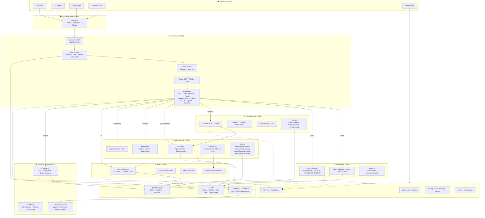

# Visão Funcional do Sistema

**Data:** 20 de julho de 2026  
**Versão:** 1.2.0

Este diagrama consolida a visão funcional do **PROMPTUARIO** a partir dos atores de negócio, dos módulos de domínio e dos fluxos principais de uso, incluindo circuit breaker, cache, eventos assíncronos e observabilidade.

## Leitura da Visão

- Os **atores** acessam o sistema pelo portal web (React + TypeScript), que centraliza as interações com o Gateway.
- O **API Gateway** distribui as requisições para os serviços adequados, aplicando JWT validation, rate limiting (Redis), circuit breaker (3 falhas → open 30s) e cache GET (TTL 60s).
- O **IAM Service** controla identidade, autenticação (incluindo OAuth2 Google e 2FA), autorização RBAC e gerenciamento de usuários.
- O **Patient Service** organiza o cadastro, dados demográficos, alergias, vacinas, medicações contínuas e anonimização LGPD.
- O **Clinical Service** concentra o fluxo assistencial principal: agenda médica, consultas, prontuários (com histórico imutável), prescrições e solicitações de exame.
- O **AI Service** executa análises assíncronas (interação medicamentosa, análise de sintomas, resumo clínico) com integração LLM (OpenAI).
- O **Reporting Service** consolida informações para relatórios e exportações (CSV, JSON, PDF) com workers Celery e agendamento via Celery Beat.
- A **observabilidade** acompanha toda a operação via Prometheus + Grafana + Loki + Jaeger + Alertmanager.
- A **infraestrutura** utiliza RabbitMQ (event bus com DLX), Redis (cache, rate limit, blacklist, broker Celery) e MinIO (storage S3 para PDFs e relatórios).

## Fluxo de Eventos (RabbitMQ)

| Evento | Publicador | Consumidores |
|--------|-----------|--------------|
| UserCreatedEvent | IAM | Patient |
| UserDeactivatedEvent | IAM | Patient, Clinical |
| PatientCreatedEvent | Patient | Clinical, Reporting |
| PatientUpdatedEvent | Patient | Clinical |
| AllergyAddedEvent | Patient | - |
| AppointmentCreatedEvent | Clinical | Reporting, AI |
| AppointmentCancelledEvent | Clinical | Reporting |
| MedicalRecordCreatedEvent | Clinical | AI, Reporting |
| PrescriptionGeneratedEvent | Clinical | AI, Reporting |
| AnalysisCompletedEvent | AI | - |

## Relação com a Documentação Existente

Este diagrama complementa o documento de [casos de uso](DIAGRAMA_DE_CASOS_DE_USO.md) e a [arquitetura de software](ARQUITETURA_DE_SOFTWARE.md), mantendo a mesma divisão por domínios do sistema.

---

**Documento Gerado:** 20 de julho de 2026  
**Versão:** 1.2.0  
**Diagrama:** `DOCUMENTATION/DIAGRAMS/Visao_Funcional_Sistema.png`