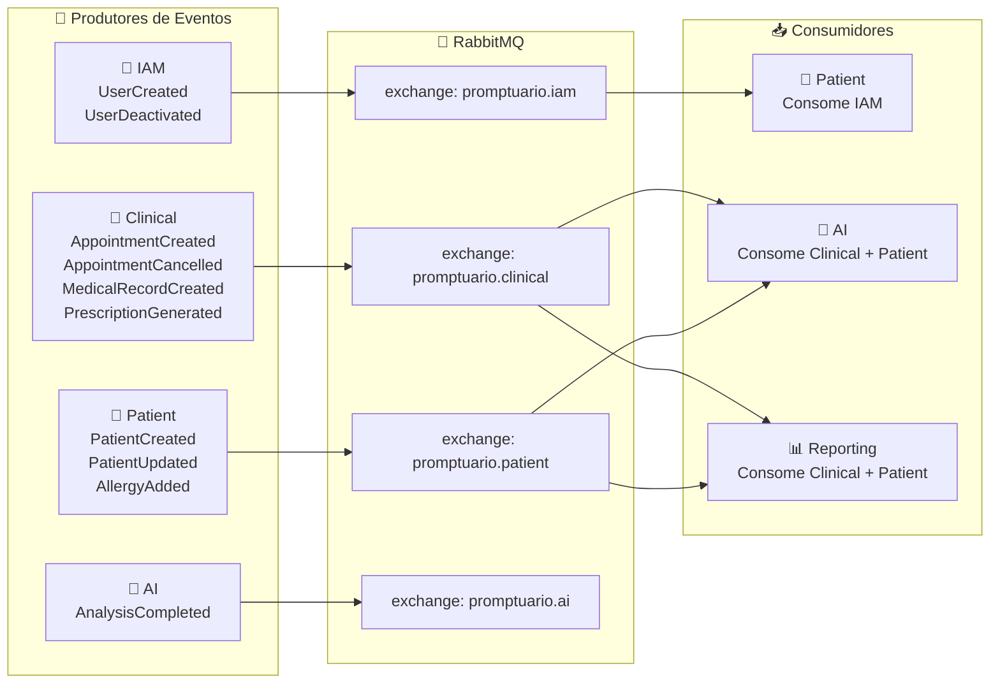

# Diagrama de Funcionalidades dos Microsserviços — Promptuário

```mermaid
graph TB
    subgraph Cliente["🌐 Cliente Externo"]
        FRONTEND["Frontend React<br/>(TypeScript + Tailwind)"]
        EXTERNAL["API Externa / Integrador"]
    end

    subgraph Gateway["🔀 API Gateway (:8000)"]
        GATEWAY["Gateway Central<br/>(FastAPI)"]
        AUTH_MIDDLEWARE["Middleware de Autenticação<br/>• Validação JWT<br/>• Blacklist Redis"]
        RATE_LIMIT["Rate Limiting<br/>• Anônimo: 30/min<br/>• Autenticado: 300/min<br/>• API Key: 120/min"]
        CIRCUIT_BREAKER["Circuit Breaker<br/>• 3 falhas → open<br/>• Reset após 30s"]
        CACHE["Cache Seletivo GET<br/>• TTL: 60s<br/>• Compressão Gzip"]
        ROUTING["Roteamento<br/>• /api/v1/auth/* → IAM<br/>• /api/v1/patients/* → Patient<br/>• /api/v1/appointments/* → Clinical<br/>• /api/v1/ai/* → AI<br/>• /api/v1/reports/* → Reporting"]
        HEALTH["Health Check<br/>• /healthz<br/>• /healthz/services"]
    end

    subgraph IAM["🔐 IAM Service (:8001)"]
        AUTH["Autenticação<br/>• POST /auth/login<br/>• POST /auth/refresh<br/>• JWT (access + refresh)"]
        USERS["Gestão de Usuários<br/>• GET/POST /users<br/>• CRUD completo"]
        ROLES["Roles e Permissões<br/>• ADMIN, DOCTOR<br/>• ATTENDANT, PATIENT<br/>• Matriz de permissões"]
        EVENTS_IAM["Eventos Publicados<br/>• UserCreated → 🐰<br/>• UserDeactivated → 🐰"]
        IAM_DB[("PostgreSQL<br/>Usuários, Roles")]
        IAM_CACHE[("Redis<br/>Token Blacklist")]
    end

    subgraph PATIENT["👤 Patient Service (:8002)"]
        PATIENT_CRUD["Cadastro de Pacientes<br/>• POST /patients<br/>• GET /patients<br/>• GET /patients/{id}<br/>• DELETE /patients/{id} (LGPD)"]
        ALLERGIES["Alergias<br/>• POST /patients/{id}/allergies"]
        VACCINES["Vacinas<br/>• Registro de vacinas"]
        MEDICATIONS["Medicamentos Contínuos<br/>• Acompanhamento"]
        EVENTS_PATIENT["Eventos Publicados<br/>• PatientCreated → 🐰<br/>• PatientUpdated → 🐰<br/>• AllergyAdded → 🐰"]
        EVENTS_PATIENT_CONSUME["Eventos Consumidos<br/>• UserCreated ← 🐰<br/>• UserDeactivated ← 🐰"]
        PATIENT_DB[("PostgreSQL<br/>Pacientes, Alergias<br/>Vacinas, Medicamentos")]
    end

    subgraph CLINICAL["🏥 Clinical Service (:8003)"]
        APPOINTMENTS["Consultas<br/>• POST /appointments<br/>• GET /appointments"]
        SCHEDULES["Agendas Médicas<br/>• POST /schedules<br/>• Gestão de horários"]
        RECORDS["Prontuários<br/>• POST /records<br/>• GET /records<br/>• Histórico imutável"]
        PRESCRIPTIONS["Prescrições<br/>• Geração de prescrições<br/>• PDF no MinIO"]
        EVENTS_CLINICAL["Eventos Publicados<br/>• AppointmentCreated → 🐰<br/>• AppointmentCancelled → 🐰<br/>• MedicalRecordCreated → 🐰<br/>• PrescriptionGenerated → 🐰"]
        CLINICAL_DB[("PostgreSQL<br/>Consultas, Prontuários<br/>Prescrições, Agendas")]
        CLINICAL_S3[("MinIO (S3)<br/>Prescrições PDF")]
    end

    subgraph AI["🤖 AI Service (:8004)"]
        DRUG_CHECK["Interação Medicamentosa<br/>• Drug Interaction Check<br/>• Alerta automático"]
        SYMPTOM_ANALYSIS["Análise de Sintomas<br/>• Avaliação de sintomas<br/>• Sugestões"]
        SUMMARY["Resumo Clínico<br/>• Geração automática<br/>• Contexto do paciente"]
        JOB_MANAGER["Gerenciamento de Jobs<br/>• POST /ai/analyze<br/>• GET /ai/jobs/{id}<br/>• GET /ai/records/{id}/analyses"]
        EVENTS_AI_CONSUME["Eventos Consumidos<br/>• MedicalRecordCreated ← 🐰<br/>• PrescriptionGenerated ← 🐰<br/>• AllergyAdded ← 🐰"]
        EVENTS_AI_PUBLISH["Eventos Publicados<br/>• AnalysisCompleted → 🐰"]
        AI_DB[("MongoDB<br/>Análises, Resultados")]
        AI_CACHE[("Redis<br/>Cache de Jobs")]
    end

    subgraph REPORTING["📊 Reporting Service (:8005)"]
        REPORT_EXPORT["Exportação de Relatórios<br/>• POST /reports/export<br/>• GET /reports/export/{id}<br/>• GET /reports/export/{id}/download"]
        DASHBOARD["Dashboard / Estatísticas<br/>• GET /reports/consultations<br/>• GET /reports/patients<br/>• GET /reports/doctors<br/>• GET /reports/summary"]
        CELERY_WORKER["Workers Celery<br/>• Processamento assíncrono<br/>• Geração CSV, JSON, PDF"]
        EVENTS_REPORT_CONSUME["Eventos Consumidos<br/>• AppointmentCreated ← 🐰<br/>• AppointmentCancelled ← 🐰<br/>• PatientCreated ← 🐰<br/>• MedicalRecordCreated ← 🐰"]
        REPORT_DB[("PostgreSQL<br/>Jobs, DailyStats")]
        REPORT_S3[("MinIO (S3)<br/>Relatórios CSV/PDF")]
    end

    subgraph INFRA["☁️ Infraestrutura Compartilhada"]
        RABBITMQ[(("🐰 RabbitMQ<br/>Event Bus<br/>promptuario.iam<br/>promptuario.patient<br/>promptuario.clinical<br/>promptuario.ai"))]
        POSTGRESQL[("🐘 PostgreSQL<br/>Banco de Dados<br/>(1 por serviço)")]
        REDIS[("🔥 Redis<br/>Cache & Broker")]
        MINIO[("📦 MinIO (S3)<br/>Armazenamento de Arquivos")]
        PROMETHEUS[("📈 Prometheus<br/>Métricas")]
        GRAFANA[("📊 Grafana<br/>Dashboards")]
        LOKI[("📝 Loki<br/>Logs Centralizados")]
    end

    %% Conexões do Gateway
    FRONTEND --> GATEWAY
    EXTERNAL --> GATEWAY
    GATEWAY --> AUTH_MIDDLEWARE
    AUTH_MIDDLEWARE --> RATE_LIMIT
    RATE_LIMIT --> CIRCUIT_BREAKER
    CIRCUIT_BREAKER --> CACHE
    CACHE --> ROUTING
    ROUTING --> HEALTH

    %% Roteamento do Gateway para os serviços
    ROUTING -->|/api/v1/auth/*| AUTH
    ROUTING -->|/api/v1/users/*| USERS
    ROUTING -->|/api/v1/patients/*| PATIENT_CRUD
    ROUTING -->|/api/v1/appointments/*| APPOINTMENTS
    ROUTING -->|/api/v1/records/*| RECORDS
    ROUTING -->|/api/v1/schedules/*| SCHEDULES
    ROUTING -->|/api/v1/ai/*| JOB_MANAGER
    ROUTING -->|/api/v1/reports/*| REPORT_EXPORT
    ROUTING -->|/api/v1/reports/*| DASHBOARD

    %% Conexões IAM
    AUTH --> IAM_DB
    USERS --> IAM_DB
    AUTH --> IAM_CACHE
    USERS --> EVENTS_IAM
    EVENTS_IAM --> RABBITMQ

    %% Conexões Patient
    PATIENT_CRUD --> PATIENT_DB
    ALLERGIES --> PATIENT_DB
    VACCINES --> PATIENT_DB
    MEDICATIONS --> PATIENT_DB
    EVENTS_PATIENT --> RABBITMQ
    RABBITMQ --> EVENTS_PATIENT_CONSUME

    %% Conexões Clinical
    APPOINTMENTS --> CLINICAL_DB
    SCHEDULES --> CLINICAL_DB
    RECORDS --> CLINICAL_DB
    PRESCRIPTIONS --> CLINICAL_S3
    EVENTS_CLINICAL --> RABBITMQ

    %% Conexões AI
    JOB_MANAGER --> AI_DB
    JOB_MANAGER --> AI_CACHE
    RABBITMQ --> EVENTS_AI_CONSUME
    EVENTS_AI_PUBLISH --> RABBITMQ

    %% Conexões Reporting
    REPORT_EXPORT --> CELERY_WORKER
    CELERY_WORKER --> REPORT_DB
    CELERY_WORKER --> REPORT_S3
    DASHBOARD --> REPORT_DB
    RABBITMQ --> EVENTS_REPORT_CONSUME

    %% Conexões Observabilidade
    GATEWAY -.-> PROMETHEUS
    AUTH -.-> PROMETHEUS
    PATIENT_CRUD -.-> PROMETHEUS
    APPOINTMENTS -.-> PROMETHEUS
    JOB_MANAGER -.-> PROMETHEUS
    REPORT_EXPORT -.-> PROMETHEUS
    PROMETHEUS -.-> GRAFANA
    LOKI -.-> GRAFANA

    %% Legenda
    subgraph LEGENDA["Legenda"]
        L1["🔀 Gateway — Porta de entrada"]
        L2["🔐 IAM — Autenticação e Autorização"]
        L3["👤 Patient — Cadastro de Pacientes"]
        L4["🏥 Clinical — Fluxo Clínico"]
        L5["🤖 AI — Inteligência Artificial"]
        L6["📊 Reporting — Relatórios"]
        L7["🐰 RabbitMQ — Eventos assíncronos"]
        L8["☁️ Infraestrutura Compartilhada"]
    end

    %% Estilo
    classDef cliente fill:#e1f5fe,stroke:#0288d1,color:#000033
    classDef gateway fill:#fff3e0,stroke:#f57c00,color:#000033
    classDef iam fill:#f3e5f5,stroke:#7b1fa2,color:#000033
    classDef patient fill:#e8f5e9,stroke:#388e3c,color:#000033
    classDef clinical fill:#fce4ec,stroke:#c62828,color:#000033
    classDef ai fill:#e0f2f1,stroke:#00796b,color:#000033
    classDef reporting fill:#fff8e1,stroke:#f9a825,color:#000033
    classDef infra fill:#eceff1,stroke:#546e7a,color:#000033

    class FRONTEND,EXTERNAL cliente
    class GATEWAY,AUTH_MIDDLEWARE,RATE_LIMIT,CIRCUIT_BREAKER,CACHE,ROUTING,HEALTH gateway
    class AUTH,USERS,ROLES,EVENTS_IAM,IAM_DB,IAM_CACHE iam
    class PATIENT_CRUD,ALLERGIES,VACCINES,MEDICATIONS,EVENTS_PATIENT,EVENTS_PATIENT_CONSUME,PATIENT_DB patient
    class APPOINTMENTS,SCHEDULES,RECORDS,PRESCRIPTIONS,EVENTS_CLINICAL,CLINICAL_DB,CLINICAL_S3 clinical
    class DRUG_CHECK,SYMPTOM_ANALYSIS,SUMMARY,JOB_MANAGER,EVENTS_AI_CONSUME,EVENTS_AI_PUBLISH,AI_DB,AI_CACHE ai
    class REPORT_EXPORT,DASHBOARD,CELERY_WORKER,EVENTS_REPORT_CONSUME,REPORT_DB,REPORT_S3 reporting
    class RABBITMQ,POSTGRESQL,REDIS,MINIO,PROMETHEUS,GRAFANA,LOKI infra
```

## Tabela Resumo de Funcionalidades por Microsserviço

| Microsserviço | Porta | Funções Principais | Banco de Dados | Eventos Publicados |
|---|---|---|---|---|
| **🔀 API Gateway** | `:8000` | Roteamento, Auth middleware, Rate limiting, Circuit breaker, Cache, Health check | Redis (cache) | — |
| **🔐 IAM Service** | `:8001` | Login, Refresh token, CRUD usuários, Roles/Permissões, JWT | PostgreSQL + Redis | `UserCreated`, `UserDeactivated` |
| **👤 Patient Service** | `:8002` | Cadastro paciente, Alergias, Vacinas, Medicamentos, Anonimização LGPD | PostgreSQL | `PatientCreated`, `PatientUpdated`, `AllergyAdded` |
| **🏥 Clinical Service** | `:8003` | Agendamento consultas, Prontuários, Prescrições, Agendas médicas | PostgreSQL + MinIO | `AppointmentCreated`, `AppointmentCancelled`, `MedicalRecordCreated`, `PrescriptionGenerated` |
| **🤖 AI Service** | `:8004` | Interação medicamentosa, Análise sintomas, Resumo clínico, Jobs assíncronos | MongoDB + Redis | `AnalysisCompleted` |
| **📊 Reporting Service** | `:8005` | Exportação relatórios (CSV/JSON/PDF), Dashboard estatísticas, Workers Celery | PostgreSQL + MinIO | — (apenas consome) |

## Fluxo de Eventos entre Microsserviços



## Matriz de Funcionalidades por Role

| Funcionalidade | PATIENT | ATTENDANT | DOCTOR | ADMIN |
|---|---|---|---|---|
| Ver próprias consultas | ✅ | — | — | ✅ |
| Listar todas consultas | ❌ | ✅ | ✅ | ✅ |
| Agendar consulta | ✅ | ✅ | ❌ | ✅ |
| Cancelar consulta | ✅* | ✅ | ✅ | ✅ |
| Criar prontuário | ❌ | ❌ | ✅ | ❌ |
| Ver próprio prontuário | ✅ | ❌ | — | ✅ |
| Gerar prescrição | ❌ | ❌ | ✅ | ❌ |
| Análise de IA | ❌ | ❌ | ✅ | ✅ |
| Relatórios | ❌ | ❌ | ✅† | ✅ |
| Gerenciar usuários | ❌ | ❌ | ❌ | ✅ |

`*` Regra de 24h de antecedência  
`†` Apenas próprios relatórios