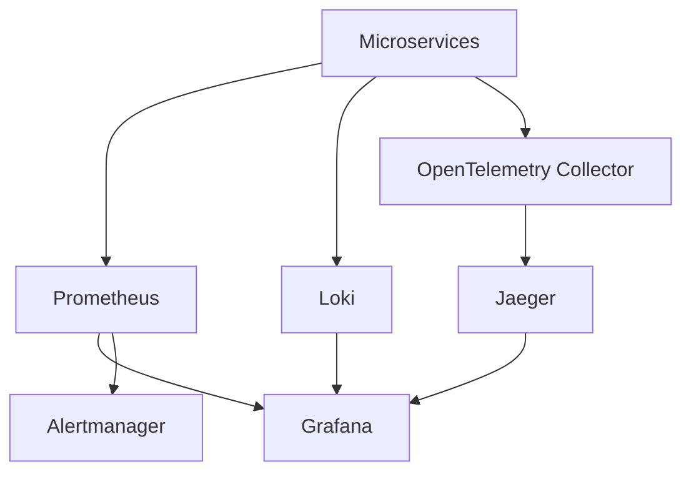
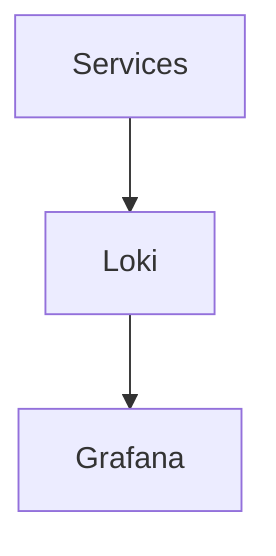
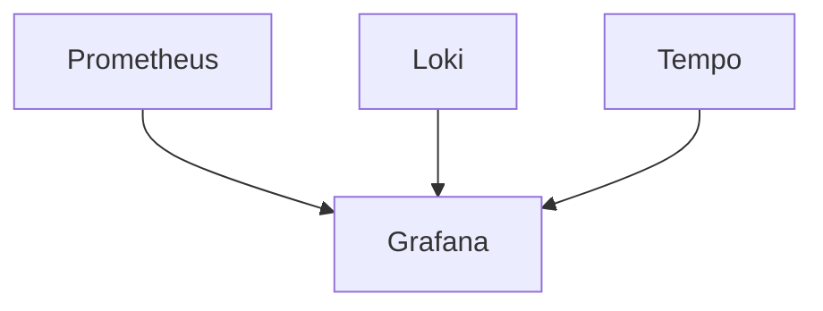
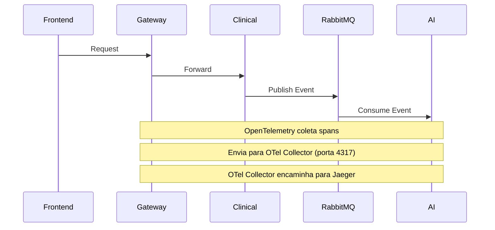

# ETAPA 11 — OBSERVABILIDADE DISTRIBUÍDA

# 1. OBJETIVO

A camada de observabilidade será responsável por:

* Monitoramento distribuído
* Logging centralizado
* Tracing distribuído
* Métricas operacionais
* Alertas
* Performance monitoring
* Diagnóstico de falhas
* Health monitoring
* Auditoria operacional

---

# 2. ARQUITETURA DE OBSERVABILIDADE



---

# 3. COMPONENTES

| Componente          | Responsabilidade       |
| ------------------- | ---------------------- |
| Prometheus          | Metrics collection     |
| Grafana             | Dashboards             |
| Loki                | Log aggregation        |
| Jaeger              | Distributed tracing    |
| OpenTelemetry       | Instrumentação e coleta|
| Alertmanager        | Alert routing          |

---

# 4. ESTRATÉGIA DE LOGGING

# Structured Logging

Todos os serviços utilizarão:

* JSON logs
* Correlation IDs
* Trace IDs
* Structured fields
* Context propagation

---

# Exemplo de Log

```json
{
  "timestamp": "2026-05-10T12:00:00Z",
  "service": "clinical-service",
  "level": "INFO",
  "message": "Medical record created",
  "trace_id": "abc123",
  "patient_id": "uuid",
  "record_id": "uuid"
}
```

---

# 5. LOGGING ARCHITECTURE



---

# 6. PYTHON LOGGING CONFIG

# shared/logging/logger.py

```python
import logging
import json_log_formatter

formatter = json_log_formatter.JSONFormatter()

json_handler = logging.StreamHandler()
json_handler.setFormatter(formatter)

logger = logging.getLogger("medical-platform")
logger.addHandler(json_handler)
logger.setLevel(logging.INFO)
```

---

# 7. REQUEST CORRELATION

# Middleware

```python
import uuid

from starlette.middleware.base import BaseHTTPMiddleware

class CorrelationIdMiddleware(BaseHTTPMiddleware):

    async def dispatch(
        self,
        request,
        call_next
    ):

        correlation_id = str(uuid.uuid4())

        request.state.correlation_id = correlation_id

        response = await call_next(request)

        response.headers[
            "X-Correlation-ID"
        ] = correlation_id

        return response
```

---

# 8. PROMETHEUS METRICS

# Objetivo

Coletar:

* Latência
* Throughput
* Error rate
* Queue metrics
* Database metrics
* API metrics

---

# FastAPI Metrics

## requirements.txt

```txt
prometheus-fastapi-instrumentator
```

---

# main.py

```python
from prometheus_fastapi_instrumentator import (
    Instrumentator
)

Instrumentator().instrument(app).expose(app)
```

---

# 9. MÉTRICAS IMPORTANTES

| Métrica                  | Tipo      |
| ------------------------ | --------- |
| http_requests_total      | Counter   |
| request_duration_seconds | Histogram |
| rabbitmq_queue_size      | Gauge     |
| db_connections           | Gauge     |
| auth_failures_total      | Counter   |

---

# 10. PROMETHEUS CONFIG

# prometheus.yml

```yaml
global:
  scrape_interval: 5s

scrape_configs:

  - job_name: "api-gateway"
    static_configs:
      - targets:
          - api-gateway:8000

  - job_name: "iam-service"
    static_configs:
      - targets:
          - iam-service:8001

  - job_name: "patient-service"
    static_configs:
      - targets:
          - patient-service:8002

  - job_name: "clinical-service"
    static_configs:
      - targets:
          - clinical-service:8003

  - job_name: "ai-service"
    static_configs:
      - targets:
          - ai-service:8004

  - job_name: "reporting-service"
    static_configs:
      - targets:
          - reporting-service:8005
```

---

# 11. GRAFANA DASHBOARDS

# Dashboards

| Dashboard   | Métricas          |
| ----------- | ----------------- |
| API Gateway | Requests, latency |
| IAM         | Auth failures     |
| Clinical    | Medical events    |
| RabbitMQ    | Queue depth       |
| PostgreSQL  | Connections       |

---

# Dashboard Architecture



---

# 12. HEALTH CHECKS

# Estratégia

Todos os serviços expõem:

```text
/health
```

---

# Exemplo

```python
@app.get("/health")

async def health_check():

    return {
        "status": "healthy"
    }
```

---

# Readiness vs Liveness

| Endpoint      | Uso                  |
| ------------- | -------------------- |
| /health/live  | Processo vivo        |
| /health/ready | Dependências prontas |

---

# 13. DISTRIBUTED TRACING (JAEGER + OPENTELEMETRY)

# Objetivo

Rastrear:

* Fluxo completo
* Requests distribuídos
* RabbitMQ propagation
* Service latency

---

# Arquitetura (Real)

O tracing distribuído é implementado via **OpenTelemetry Collector** + **Jaeger**:



---

# OpenTelemetry

## requirements.txt

```txt
opentelemetry-api
opentelemetry-sdk
opentelemetry-instrumentation-fastapi
```

---

# Instrumentação

```python
from opentelemetry.instrumentation.fastapi import (
    FastAPIInstrumentor
)

FastAPIInstrumentor.instrument_app(app)
```

---

# 14. ERROR TRACKING

# Estratégia

Capturar:

* Exceptions
* Timeouts
* Queue failures
* Database failures
