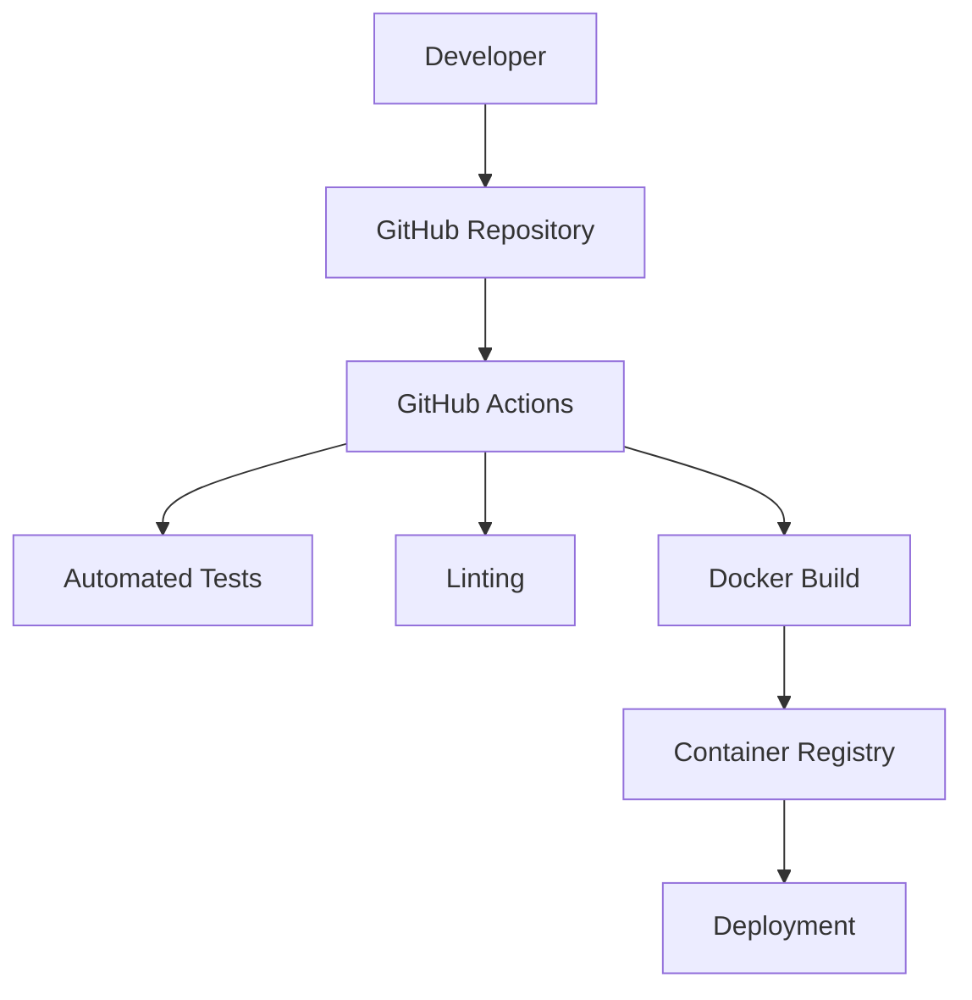
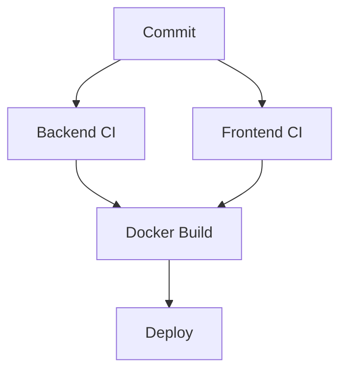

# ETAPA 12 — CI/CD DISTRIBUÍDO

# 1. OBJETIVO

A arquitetura CI/CD será responsável por:

* Build automatizado
* Testes automatizados
* Quality gates
* Docker image builds
* Multi-service orchestration
* Deploy contínuo
* Versionamento distribuído
* Pipeline isolado por serviço
* Segurança de supply chain

---

# 2. ARQUITETURA CI/CD



---

# 3. ESTRUTURA CI/CD

```text
.github/

└── workflows/

    ├── backend-ci.yml

    ├── frontend-ci.yml

    ├── docker-build.yml

    ├── deploy.yml

    └── monorepo-orchestration.yml
```

---

# 4. ESTRATÉGIA

# Monorepo Strategy

O projeto utiliza:

* Monorepo distribuído
* Pipelines independentes
* Deploy isolado
* Shared workflows

---

# Trigger Strategy

| Evento        | Pipeline       |
| ------------- | -------------- |
| Push backend  | Backend CI     |
| Push frontend | Frontend CI    |
| Tag release   | Docker Publish |
| Main branch   | Deploy         |

---

# 5. BACKEND CI PIPELINE

# .github/workflows/backend-ci.yml

```yaml
name: Backend CI

on:
  push:
    paths:
      - "backend/**"

  pull_request:
    paths:
      - "backend/**"

jobs:

  backend-tests:

    runs-on: ubuntu-latest

    strategy:
      matrix:
        service:
          - iam-service
          - patient-service
          - clinical-service
          - ai-service
          - reporting-service
          - api-gateway

    steps:

      - name: Checkout
        uses: actions/checkout@v4

      - name: Setup Python
        uses: actions/setup-python@v5
        with:
          python-version: "3.12"

      - name: Install Dependencies
        run: |
          cd backend/${{ matrix.service }}
          pip install -r requirements.txt

      - name: Run Lint
        run: |
          cd backend/${{ matrix.service }}
          pip install flake8
          flake8 .

      - name: Run Tests
        run: |
          cd backend/${{ matrix.service }}
          pytest
```

---

# 6. FRONTEND PIPELINE

# .github/workflows/frontend-ci.yml

```yaml
name: Frontend CI

on:
  push:
    paths:
      - "frontend/**"

  pull_request:
    paths:
      - "frontend/**"

jobs:

  frontend:

    runs-on: ubuntu-latest

    steps:

      - name: Checkout
        uses: actions/checkout@v4

      - name: Setup Node
        uses: actions/setup-node@v4
        with:
          node-version: "20"

      - name: Install Dependencies
        run: |
          cd frontend
          npm install

      - name: Lint
        run: |
          cd frontend
          npm run lint

      - name: Build
        run: |
          cd frontend
          npm run build

      - name: Run Tests
        run: |
          cd frontend
          npm run test
```

---

# 7. DOCKER BUILD PIPELINE

# .github/workflows/docker-build.yml

```yaml
name: Docker Build & Publish

on:
  push:
    branches:
      - main

jobs:

  docker-build:

    runs-on: ubuntu-latest

    strategy:
      matrix:
        service:
          - api-gateway
          - iam-service
          - patient-service
          - clinical-service
          - ai-service
          - reporting-service

    steps:

      - name: Checkout
        uses: actions/checkout@v4

      - name: Docker Login
        uses: docker/login-action@v3
        with:
          username: ${{ secrets.DOCKER_USERNAME }}
          password: ${{ secrets.DOCKER_PASSWORD }}

      - name: Build Docker Image
        run: |
          docker build \
            -t myorg/${{ matrix.service }}:latest \
            ./backend/${{ matrix.service }}

      - name: Push Docker Image
        run: |
          docker push myorg/${{ matrix.service }}:latest
```

---

# 8. FRONTEND DOCKER BUILD

# Frontend Publish

```yaml
- name: Build Frontend Image

  run: |
    docker build \
      -t myorg/frontend:latest \
      ./frontend

- name: Push Frontend Image

  run: |
    docker push myorg/frontend:latest
```

---

# 9. DEPLOY PIPELINE

# .github/workflows/deploy.yml

```yaml
name: Deploy

on:
  workflow_run:
    workflows:
      - Docker Build & Publish
    types:
      - completed

jobs:

  deploy:

    runs-on: ubuntu-latest

    steps:

      - name: Deploy via SSH

        uses: appleboy/ssh-action@v1

        with:
          host: ${{ secrets.SERVER_HOST }}
          username: ${{ secrets.SERVER_USER }}
          key: ${{ secrets.SERVER_SSH_KEY }}

          script: |

            cd medical-platform

            docker compose pull

            docker compose up -d
```

---

# 10. MULTI-SERVICE ORCHESTRATION

# Pipeline Orquestrado



---

# 11. QUALITY GATES

# Backend

| Validação  | Ferramenta |
| ---------- | ---------- |
| Lint       | flake8     |
| Formatting | black      |
| Typing     | mypy       |
| Tests      | pytest     |

---

# Frontend

| Validação  | Ferramenta |
| ---------- | ---------- |
| Lint       | ESLint     |
| Formatting | Prettier   |
| Tests      | Vitest     |

---

# 12. TEST STRATEGY

# Backend

## Tipos

* Unit tests
* Integration tests
* API tests
* Repository tests

---

# Frontend

## Tipos
