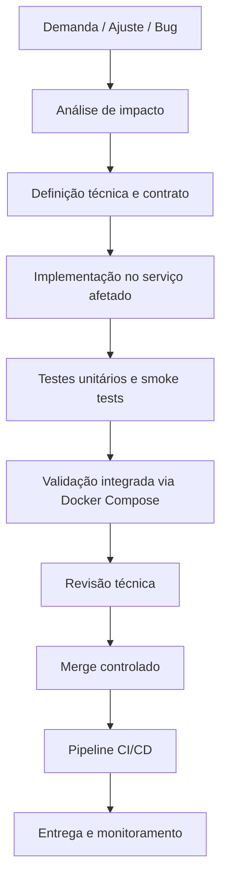

# ETAPA 13 — DEFINIÇÃO DO PROCESSO DE SOFTWARE

Este documento define como o processo de software será conduzido no PROMPTUARIO Backend, com foco em execução prática, validação contínua e entrega segura em um ambiente distribuído.

---

## 1. Objetivo

Estabelecer um processo de desenvolvimento e entrega que permita evoluir os microserviços com previsibilidade, rastreabilidade e baixa taxa de regressão.

O processo cobre:

- Planejamento e refinamento de demanda
- Implementação por serviço
- Validação local e integrada
- Revisão técnica
- Integração contínua
- Entrega incremental
- Operação assistida por observabilidade

---

## 2. Princípios de Condução

O trabalho será conduzido segundo os seguintes princípios:

- Cada serviço evolui com responsabilidade isolada por domínio
- Mudanças pequenas e frequentes têm prioridade sobre lotes grandes
- Toda alteração funcional deve vir acompanhada de validação automatizada
- A documentação deve ser atualizada junto com a implementação
- As integrações entre serviços devem ser validadas por smoke tests e health checks
- O Gateway é o ponto único de entrada para consumo externo
- O ambiente local deve reproduzir o comportamento esperado em container

---

## 3. Fluxo do Processo

---

## 4. Etapas do Processo

### 4.1 Entrada da demanda

A demanda pode surgir de:

- Correção de bug
- Evolução de endpoint
- Ajuste de regra de negócio
- Necessidade de integração entre serviços
- Requisito de observabilidade, segurança ou infraestrutura

Nesta etapa, a demanda deve ser traduzida em um objetivo claro, com o menor escopo possível para a primeira entrega.

### 4.2 Análise de impacto

Antes de codificar, o impacto deve ser verificado em:

- Serviço proprietário da regra
- Gateway, se houver roteamento novo ou mudança de contrato
- Banco de dados do serviço
- Eventos RabbitMQ, quando houver publicação ou consumo
- Documentação e smoke tests

### 4.3 Definição técnica

A solução deve ser descrita com:

- Endpoint(s) envolvidos
- Método HTTP
- Request e response esperados
- Regras de autenticação e role necessária
- Persistência afetada
- Eventos produzidos ou consumidos
- Estratégia de teste

### 4.4 Implementação

A implementação deve ocorrer no serviço responsável pelo domínio, respeitando a arquitetura já adotada:

- FastAPI para a camada HTTP
- SQLAlchemy async para serviços relacionais
- Motor para o AI Service
- Redis para blacklist, cache e apoio operacional
- Celery para tarefas assíncronas no Reporting
- RabbitMQ para eventos e desacoplamento

Mudanças devem ser preferencialmente pequenas e autocontidas.

### 4.5 Validação local

A validação local deve seguir esta ordem:

1. Subir infraestrutura ou ambiente necessário
2. Executar testes unitários do serviço afetado
3. Executar smoke tests do conjunto de serviços
4. Validar health checks e documentação Swagger
5. Testar o fluxo autenticado via Gateway

Comandos de referência já existentes no projeto:

- `make up`
- `make test`
- `make smoke-fastapi`
- `python scripts/fastapi_services_smoke.py`

### 4.6 Revisão técnica

Antes do merge, a mudança deve ser revisada para garantir:

- Aderência ao padrão de projeto do serviço
- Ausência de quebra de contrato entre serviços
- Cobertura de teste suficiente
- Documentação coerente com a implementação
- Nomes, rotas e payloads consistentes

### 4.7 Integração e entrega

Depois do merge, a integração deve ser acompanhada por:

- Build de imagem Docker
- Pipelines do GitHub Actions
- Execução das suites automatizadas
- Publicação de imagem ou artefato, quando aplicável
- Validação dos health checks em ambiente alvo

---

## 5. Como o Processo Será Conduzido na Prática

O processo diário de trabalho deve seguir esta sequência:

1. Identificar o serviço dono da mudança.
2. Confirmar o contrato de API e os impactos no Gateway.
3. Implementar a alteração no menor recorte possível.
4. Atualizar testes do serviço e o smoke test, se o fluxo cruzar múltiplos serviços.
5. Validar localmente com `pytest`, Docker Compose e smoke tests.
6. Corrigir falhas até que o conjunto fique estável.
7. Atualizar documentação de endpoints, arquitetura ou operação, quando necessário.
8. Submeter para revisão técnica.
9. Só então consolidar a entrega.

Esse fluxo evita mudanças grandes sem validação e reduz risco de regressão em uma solução com vários serviços independentes.

---

## 6. Qualidade e Critérios de Aceite

Uma alteração só deve ser considerada pronta quando atender aos seguintes critérios:

- O endpoint ou função responde conforme o contrato esperado
- A autenticação e autorização estão corretas
- Os testes automatizados passam
- O smoke test distribuído passa
- A documentação está atualizada
- O comportamento não degrada health checks nem o fluxo do Gateway
- Quando há async jobs, o ciclo de vida do job está coberto

### Critérios mínimos por tipo de mudança

| Tipo de mudança | Critério mínimo |
|-----------------|-----------------|
| Endpoint novo | Teste do endpoint + documentação + smoke test, se aplicável |
| Regra de negócio | Teste unitário + teste de integração relevante |
| Integração entre serviços | Validação do contrato + smoke test distribuído |
| Mudança de infraestrutura | Health checks + startup completo via Compose |
| Mudança de autenticação | Login, autorização e acesso protegido validados |

---

## 7. Papéis e Responsabilidades

| Papel | Responsabilidade |
|------|------------------|
| Desenvolvimento | Implementar a mudança com foco em isolamento e qualidade |
| Revisão técnica | Validar contrato, segurança, consistência e testes |
| Integração | Garantir que o fluxo distribuído permaneça funcional |
| Operação | Monitorar saúde, logs, métricas e alertas |
| Documentação | Manter docs alinhadas à implementação real |

---

## 8. Ferramentas que Sustentam o Processo

| Ferramenta | Uso no processo |
|-----------|-----------------|
| Docker Compose | Subida do ambiente distribuído |
| Makefile | Comandos padronizados de execução |
| pytest | Testes automatizados por serviço |
| scripts/fastapi_services_smoke.py | Smoke test completo dos serviços |
| GitHub Actions | CI/CD e quality gates |
| Prometheus / Grafana / Loki / Tempo | Observabilidade e diagnóstico |

---

## 9. Interação Entre Processo e Arquitetura

O processo foi desenhado para a arquitetura distribuída do sistema:

- O Gateway concentra o tráfego de entrada.
- Cada serviço é validado de forma independente, mas a entrega considera o sistema integrado.
- A persistência por serviço reduz o acoplamento de mudanças.
- Eventos e filas evitam dependências síncronas desnecessárias.
- A observabilidade permite detectar falhas de integração cedo.

---

## 10. Resumo Operacional

Em termos práticos, o processo será conduzido assim:

- Planeja-se a mudança com base no domínio impactado.
- Implementa-se a menor unidade funcional possível.
- Valida-se localmente com testes e smoke checks.
- Revisa-se o contrato e a qualidade antes de mesclar.
- Entrega-se somente após o pipeline confirmar a estabilidade.
- Monitora-se o comportamento em runtime para detectar regressões.

---

**Última atualização:** 11 de maio de 2026  
**Versão:** 1.0  
**Escopo:** Processo de software para o backend distribuído PROMPTUARIO
