# ETAPA 14 — MODELO LÓGICO DO BANCO DE DADOS

Este índice organiza o modelo lógico de dados do PROMPTUARIO Backend em documentos separados por serviço. A abordagem continua sendo **database-per-service**, com integração entre domínios por IDs lógicos, eventos e projeções locais quando necessário.

## 1. Documentos por Serviço

- [IAM Service](ETAPA_14_Modelo_Logico_IAM_Service.md)
- [Patient Service](ETAPA_14_Modelo_Logico_Patient_Service.md)
- [Clinical Service](ETAPA_14_Modelo_Logico_Clinical_Service.md)
- [Reporting Service](ETAPA_14_Modelo_Logico_Reporting_Service.md)
- [AI Service](ETAPA_14_Modelo_Logico_AI_Service.md)

## 2. Princípios do Modelo

- Cada serviço é dono dos seus dados físicos.
- Relações entre serviços são feitas por identificadores lógicos, não por foreign keys entre bancos distintos.
- Projeções locais são usadas quando um serviço precisa ler dados de outro contexto com menor acoplamento.
- O modelo prioriza rastreabilidade, isolamento e evolução independente.

## 3. Visão Geral

```mermaid
flowchart TD
    IAM[(IAM DB - PostgreSQL)]
    PATIENT[(Patient DB - PostgreSQL)]
    CLINICAL[(Clinical DB - PostgreSQL)]
    REPORTING[(Reporting DB - PostgreSQL)]
    AI[(AI DB - MongoDB)]

    USER[users]
    TOKEN[refresh_tokens]
    P[patients]
    A[allergies]
    V[vaccines]
    M[continuous_medications]
    PS[patient_projections]
    DS[doctor_schedules]
    TS[time_slots]
    AP[appointments]
    MR[medical_records]
    H[medical_record_history]
    PR[prescriptions]
    ER[exam_requests]
    RJ[report_jobs]
    ST[daily_stats]
    AJ[analysis_jobs]

    IAM --> USER
    IAM --> TOKEN
    PATIENT --> P
    PATIENT --> A
    PATIENT --> V
    PATIENT --> M
    CLINICAL --> PS
    CLINICAL --> DS
    CLINICAL --> TS
    CLINICAL --> AP
    CLINICAL --> MR
    CLINICAL --> H
    CLINICAL --> PR
    CLINICAL --> ER
    REPORTING --> RJ
    REPORTING --> ST
    AI --> AJ
```

## 4. Regras Gerais

- IDs são predominantemente UUIDs em formato string de 36 caracteres.
- Campos históricos e de auditoria devem ser append-only quando possível.
- Enumerações controlam estados e tipos sensíveis a domínio.
- JSON é usado apenas em pontos onde a estrutura é naturalmente variável, como diagnósticos, parâmetros de relatório e resultados de IA.
- Relações interserviços nunca devem ser implementadas como foreign key física entre bancos distintos.

## 5. Atualização

**Última atualização:** 11 de maio de 2026  
**Versão:** 1.0  
**Escopo:** Modelo lógico de dados do backend distribuído PROMPTUARIO
