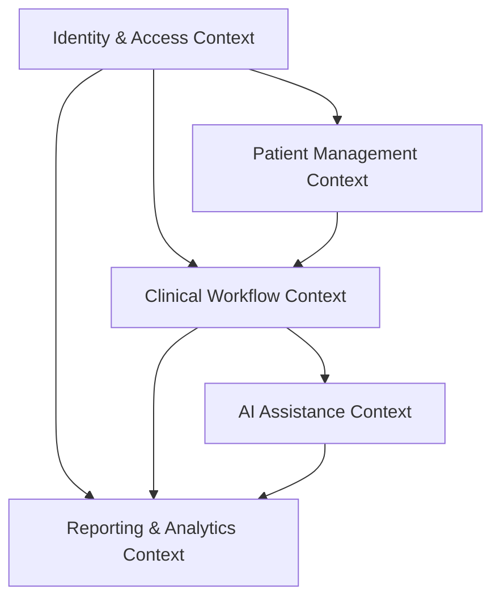
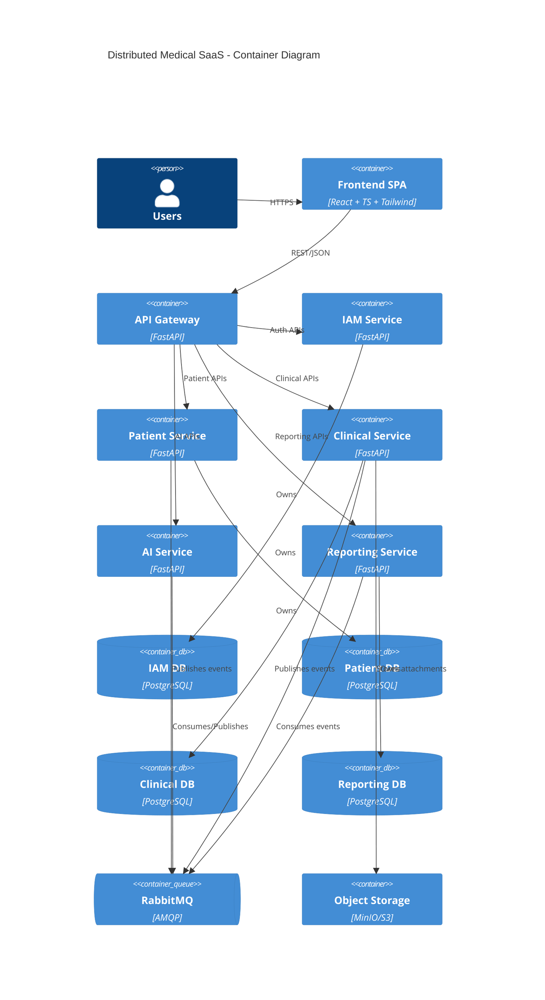
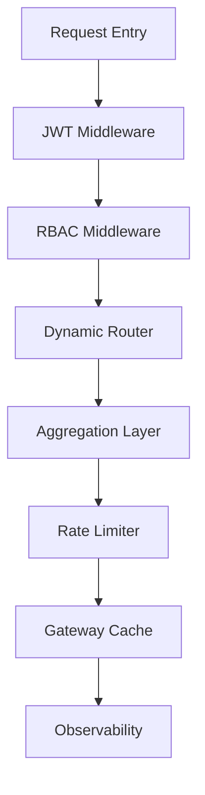
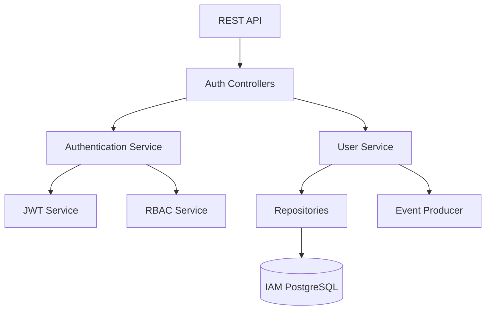

# ETAPA 1 — ARQUITETURA GLOBAL

# 1. DOMAIN ANALYSIS & BOUNDED CONTEXTS

O monólito original possui múltiplos domínios fortemente acoplados dentro do mesmo runtime.

A nova arquitetura distribui responsabilidades utilizando:

* Domain-Driven Design (DDD)
* Event-Driven Architecture (EDA)
* Clean Architecture
* Database-per-service
* API Gateway Pattern
* RabbitMQ
* CQRS-inspired reporting

---

# BOUNDED CONTEXT MAP



---

# 2. BOUNDED CONTEXTS

## 2.1 Identity & Access Context

### Responsabilidades

* Usuários
* Autenticação
* JWT
* RBAC
* Sessões
* Políticas de segurança

### Serviço

* IAM Service

---

## 2.2 Patient Context

### Responsabilidades

* Cadastro de pacientes
* Dados demográficos
* Metadados
* Informações de contato

### Serviço

* Patient Service

---

## 2.3 Clinical Context

### Responsabilidades

* Prontuários
* Prescrições
* Exames
* Uploads
* PDFs
* Histórico clínico
* Timeline médica

### Serviço

* Clinical Service

---

## 2.4 AI Assistance Context

### Responsabilidades

* NLP
* Resumos clínicos
* Sugestões médicas
* Orquestração de IA

### Serviço

* AI Service

---

## 2.5 Reporting Context

### Responsabilidades

* Dashboards
* KPIs
* Analytics
* Read models
* Relatórios

### Serviço

* Reporting Service

---

# 3. ESTRUTURA GLOBAL DO PROJETO

```text
backend/
├── api-gateway/
├── iam-service/
├── patient-service/
├── clinical-service/
├── ai-service/
├── reporting-service/
└── shared/

frontend/
└── src/
    ├── components/
    ├── pages/
    ├── services/
    ├── hooks/
    ├── contexts/
    ├── layouts/
    ├── routes/
    ├── utils/
    └── types/
```
---

# 4. C4 — CONTAINER DIAGRAM



---

# 5. API GATEWAY ARCHITECTURE

## Responsabilidades

* Roteamento centralizado
* JWT validation
* RBAC
* Aggregation layer
* Rate limiting
* Observabilidade
* Segurança

---

## Component Diagram



---

## Estratégia de Roteamento

```text
/api/v1/auth/*        -> IAM Service
/api/v1/patients/*    -> Patient Service
/api/v1/clinical/*    -> Clinical Service
/api/v1/ai/*          -> AI Service
/api/v1/reports/*     -> Reporting Service
```

---

# 6. IAM SERVICE

## Responsabilidades

* Login
* JWT
* RBAC
* Usuários
* Roles
* Sessões

---

## Component Diagram



---

## Estrutura Interna

```text
iam-service/
├── app/
│   ├── api/
│   ├── auth/
│   ├── users/
│   ├── roles/
│   ├── jwt/
│   ├── repositories/
│   └── messaging/
```

---

## Database Ownership

Tabelas:

* users
* roles
* permissions
* refresh_tokens

---

## RabbitMQ

### Publica

* UserCreated
* UserRoleUpdated

### Consome

* Nenhum inicialmente

---

# 7. PATIENT SERVICE

## Responsabilidades

* Cadastro de pacientes
* Demografia
* Contatos
* Metadados
