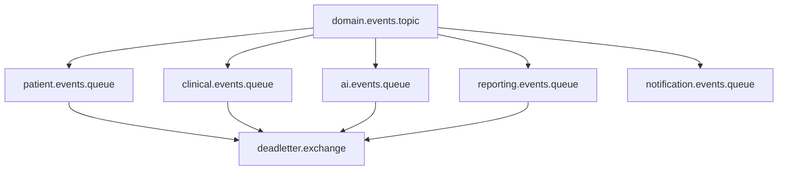
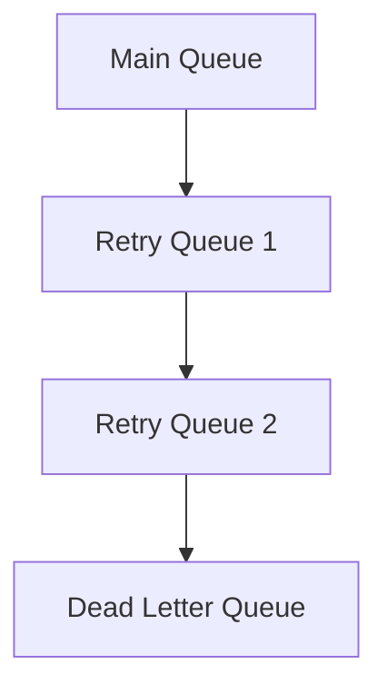
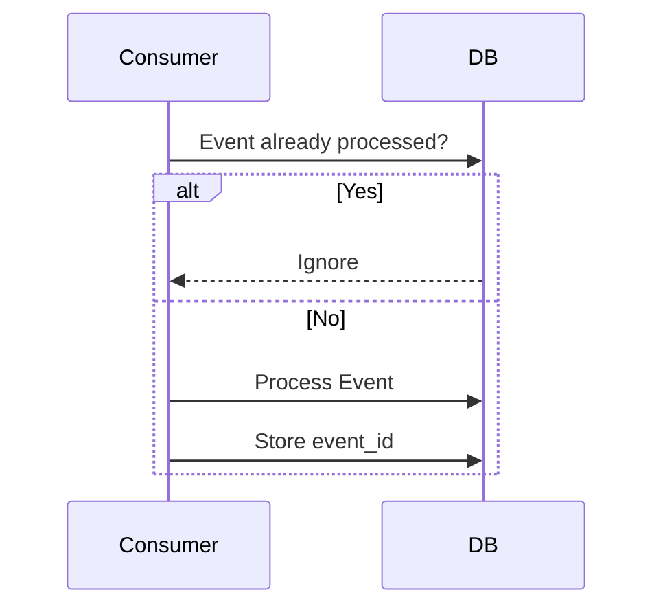
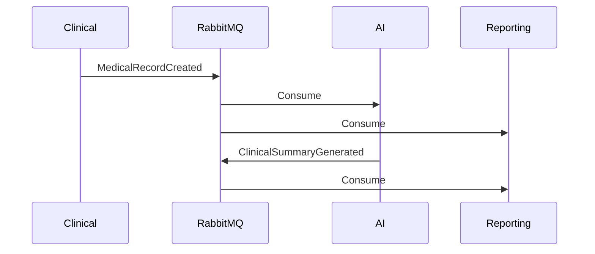
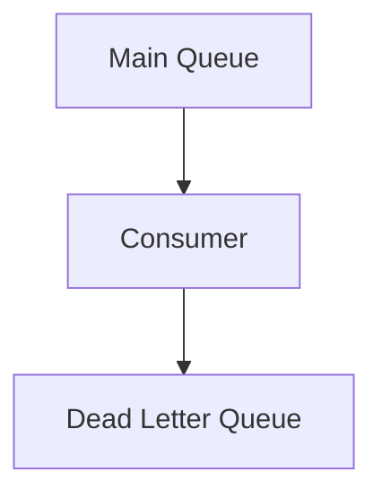
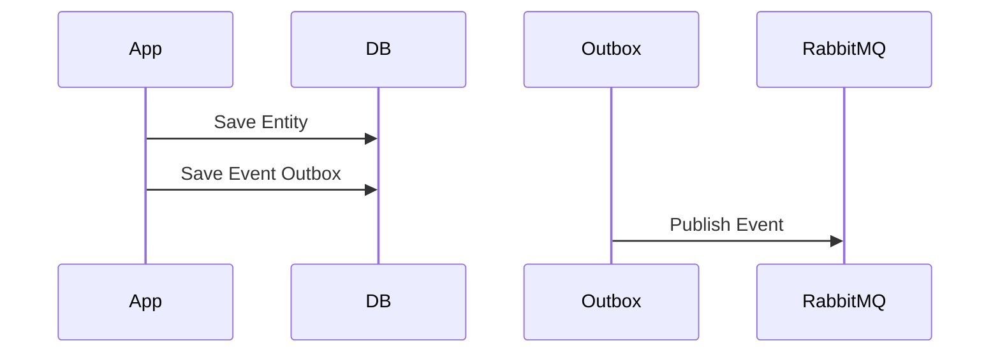

# ETAPA 2 — EVENTOS E RABBITMQ

# 1. EVENT-DRIVEN ARCHITECTURE OVERVIEW

A plataforma utiliza:

* RabbitMQ
* AMQP 0-9-1
* Event choreography
* Comunicação assíncrona
* Eventual consistency
* Retry + DLQ
* Consumers idempotentes

---

# PRINCÍPIOS ARQUITETURAIS

| Objetivo       | Estratégia            |
| -------------- | --------------------- |
| Desacoplamento | Eventos assíncronos   |
| Escalabilidade | Consumers horizontais |
| Resiliência    | Retry + DLQ           |
| Evolução       | Versionamento         |
| Confiabilidade | ACK/NACK              |
| Performance    | Async processing      |

---

# 2. TOPOLOGIA GLOBAL DO RABBITMQ



---

# 3. EXCHANGE STRATEGY

## Exchange Principal

```text
Exchange: domain.events.topic
Type: topic
Durable: true
```

---

## Routing Keys

```text
patient.created
patient.updated

medical_record.created
medical_record.updated
medical_record.closed

prescription.created

exam.uploaded

user.registered

report.generated

ai.summary.generated
```

---

# 4. FILAS (QUEUES)

## Filas Principais

| Queue                     | Consumer             |
| ------------------------- | -------------------- |
| patient.events.queue      | Patient Service      |
| clinical.events.queue     | Clinical Service     |
| ai.events.queue           | AI Service           |
| reporting.events.queue    | Reporting Service    |
| notification.events.queue | Notification Service |

---

## Dead Letter Queues

| DLQ                  | Purpose                                |
| -------------------- | -------------------------------------- |
| patient.events.dlq   | Eventos inválidos do domínio Patient   |
| clinical.events.dlq  | Eventos inválidos do domínio Clinical  |
| ai.events.dlq        | Eventos inválidos do domínio AI        |
| reporting.events.dlq | Eventos inválidos do domínio Reporting |

---

# 5. RETRY STRATEGY



---

## Política de Retry

| Attempt     | Delay |
| ----------- | ----- |
| Retry #1    | 5s    |
| Retry #2    | 30s   |
| Retry #3    | 5min  |
| Falha Final | DLQ   |

---

# 6. EVENT ENVELOPE PADRÃO

Todos eventos compartilham envelope comum.

```json
{
  "event_id": "uuid",
  "event_type": "medical_record.created",
  "event_version": "v1",
  "occurred_at": "2026-05-09T15:00:00Z",
  "producer": "clinical-service",
  "correlation_id": "uuid",
  "tenant_id": "tenant-001",
  "payload": {}
}
```

---

## Campos

| Campo          | Finalidade            |
| -------------- | --------------------- |
| event_id       | Idempotência          |
| event_type     | Tipo lógico do evento |
| event_version  | Compatibilidade       |
| occurred_at    | Ordenação             |
| producer       | Auditoria             |
| correlation_id | Distributed tracing   |
| tenant_id      | Multi-tenancy         |

---

# 7. IDEMPOTENCY STRATEGY

## Tabela de Controle

```sql
CREATE TABLE processed_events (
    event_id UUID PRIMARY KEY,
    processed_at TIMESTAMP
);
```

---

## Fluxo



---

# 8. VERSIONAMENTO DE EVENTOS

## Estratégia

```text
v1
v2
v3
```

---

## Regras

* Nunca quebrar consumers antigos
* Mudanças incompatíveis geram nova versão
* Backward compatibility obrigatória

---

# 9. DOMAIN EVENTS

# EVENTO — UserRegistered

## Objetivo

Novo usuário criado no IAM.

---

## Publisher

```text
iam-service
```

---

## Consumers

| Consumer             | Ação               |
| -------------------- | ------------------ |
| Patient Service      | Vincular paciente  |
| Reporting Service    | Atualizar métricas |
| Notification Service | Welcome email      |

---

## Routing Key

```text
user.registered
```

---

## Payload

```json
{
  "event_id": "3f7e2b92-6b0d-4b8e-a3e4-111111111111",
  "event_type": "user.registered",
  "event_version": "v1",
  "occurred_at": "2026-05-09T15:00:00Z",
  "producer": "iam-service",
  "correlation_id": "c1f8e999",
  "tenant_id": "tenant-001",
  "payload": {
    "user_id": "usr-123",
    "name": "Carlos Eduardo",
    "email": "carlos@email.com",
    "role": "doctor",
    "status": "active"
  }
}
```

---

# EVENTO — PatientCreated

## Objetivo

Novo paciente cadastrado.

---

## Publisher

```text
patient-service
```

---

## Consumers

| Consumer          | Ação           |
| ----------------- | -------------- |
| Clinical Service  | Criar timeline |
| Reporting Service | Atualizar KPIs |

---

## Routing Key

```text
patient.created
```

---

## Payload

```json
{
  "event_id": "uuid",
  "event_type": "patient.created",
  "event_version": "v1",
  "occurred_at": "2026-05-09T15:10:00Z",
  "producer": "patient-service",
  "correlation_id": "uuid",
  "tenant_id": "tenant-001",
  "payload": {
    "patient_id": "pat-001",
    "name": "Maria Silva",
    "birth_date": "1990-01-01",
    "gender": "female",
    "phone": "+55 84 99999-9999"
  }
}
```

---

# EVENTO — PatientUpdated

## Objetivo

Atualização demográfica.

---

## Publisher

```text
patient-service
```

---

## Consumers

| Consumer          | Ação                  |
| ----------------- | --------------------- |
| Clinical Service  | Sync patient snapshot |
| Reporting Service | Refresh projections   |

---

## Routing Key

```text
patient.updated
```

---

## Payload

```json
{
  "event_id": "uuid",
  "event_type": "patient.updated",
  "event_version": "v1",
  "occurred_at": "2026-05-09T15:15:00Z",
  "producer": "patient-service",
  "correlation_id": "uuid",
  "tenant_id": "tenant-001",
  "payload": {
    "patient_id": "pat-001",
    "updated_fields": [
      "phone",
      "address"
    ],
    "phone": "+55 84 98888-8888"
  }
}
```

---

# EVENTO — MedicalRecordCreated

## Objetivo

Novo prontuário criado.

---

## Publisher

```text
clinical-service
```

---

## Consumers

| Consumer          | Ação                |
| ----------------- | ------------------- |
| AI Service        | Gerar resumo        |
| Reporting Service | Atualizar analytics |

---

## Routing Key

```text
medical_record.created
```

---

## Payload

```json
{
  "event_id": "uuid",
  "event_type": "medical_record.created",
  "event_version": "v1",
  "occurred_at": "2026-05-09T15:20:00Z",
  "producer": "clinical-service",
  "correlation_id": "uuid",
  "tenant_id": "tenant-001",
  "payload": {
    "record_id": "mr-001",
    "patient_id": "pat-001",
    "doctor_id": "doc-001",
    "specialty": "cardiology",
    "status": "open",
    "created_at": "2026-05-09T15:20:00Z"
  }
}
```

---

# EVENTO — MedicalRecordUpdated

## Objetivo

Prontuário alterado.

---

## Publisher

```text
clinical-service
```

---

## Consumers

| Consumer          | Ação                |
| ----------------- | ------------------- |
| AI Service        | Regenerar resumo    |
| Reporting Service | Atualizar projeções |

---

## Routing Key

```text
medical_record.updated
```

---

## Payload

```json
{
  "event_id": "uuid",
  "event_type": "medical_record.updated",
  "event_version": "v1",
  "occurred_at": "2026-05-09T15:30:00Z",
  "producer": "clinical-service",
  "correlation_id": "uuid",
  "tenant_id": "tenant-001",
  "payload": {
    "record_id": "mr-001",
    "updated_fields": [
      "diagnosis",
      "notes"
    ],
    "updated_by": "doc-001"
  }
}
```

---

# EVENTO — MedicalRecordClosed

## Objetivo

Consulta finalizada.

---

## Publisher

```text
clinical-service
```

---

## Consumers

| Consumer          | Ação               |
| ----------------- | ------------------ |
| Reporting Service | Atualizar métricas |
| AI Service        | Resumo final       |

---

## Routing Key

```text
medical_record.closed
```

---

## Payload

```json
{
  "event_id": "uuid",
  "event_type": "medical_record.closed",
  "event_version": "v1",
  "occurred_at": "2026-05-09T16:00:00Z",
  "producer": "clinical-service",
  "correlation_id": "uuid",
  "tenant_id": "tenant-001",
  "payload": {
    "record_id": "mr-001",
    "closed_by": "doc-001",
    "duration_minutes": 45
  }
}
```

---

# EVENTO — PrescriptionCreated

## Objetivo

Nova prescrição médica.

---

## Publisher

```text
clinical-service
```

---

## Consumers

| Consumer             | Ação               |
| -------------------- | ------------------ |
| Reporting Service    | Métricas           |
| Notification Service | Notificar paciente |

---

## Routing Key

```text
prescription.created
```

---

## Payload

```json
{
  "event_id": "uuid",
  "event_type": "prescription.created",
  "event_version": "v1",
  "occurred_at": "2026-05-09T15:45:00Z",
  "producer": "clinical-service",
  "correlation_id": "uuid",
  "tenant_id": "tenant-001",
  "payload": {
    "prescription_id": "pre-001",
    "record_id": "mr-001",
    "doctor_id": "doc-001",
    "patient_id": "pat-001",
    "medications": [
      {
        "name": "Losartan",
        "dosage": "50mg"
      }
    ]
  }
}
```

---

# EVENTO — ExamUploaded

## Objetivo

Novo exame anexado.

---

## Publisher

```text
clinical-service
```

---

## Consumers

| Consumer          | Ação               |
| ----------------- | ------------------ |
| AI Service        | Analisar documento |
| Reporting Service | Atualizar métricas |

---

## Routing Key

```text
exam.uploaded
```

---

## Payload

```json
{
  "event_id": "uuid",
  "event_type": "exam.uploaded",
  "event_version": "v1",
  "occurred_at": "2026-05-09T16:10:00Z",
  "producer": "clinical-service",
  "correlation_id": "uuid",
  "tenant_id": "tenant-001",
  "payload": {
    "exam_id": "exam-001",
    "record_id": "mr-001",
    "patient_id": "pat-001",
    "file_url": "s3://bucket/exams/exam-001.pdf",
    "mime_type": "application/pdf"
  }
}
```

---

# EVENTO — ClinicalSummaryGenerated

## Objetivo

Resumo clínico gerado pela IA.

---

## Publisher

```text
ai-service
```

---

## Consumers

| Consumer          | Ação                |
| ----------------- | ------------------- |
| Reporting Service | Atualizar dashboard |
| Clinical Service  | Anexar resumo       |

---

## Routing Key

```text
ai.summary.generated
```

---

## Payload

```json
{
  "event_id": "uuid",
  "event_type": "ai.summary.generated",
  "event_version": "v1",
  "occurred_at": "2026-05-09T16:15:00Z",
  "producer": "ai-service",
  "correlation_id": "uuid",
  "tenant_id": "tenant-001",
  "payload": {
    "record_id": "mr-001",
    "summary": "Paciente apresenta evolução estável.",
    "confidence_score": 0.94
  }
}
```

---

# EVENTO — ReportGenerated

## Objetivo

Relatório exportado.

---

## Publisher

```text
reporting-service
```

---

## Consumers

| Consumer             | Ação              |
| -------------------- | ----------------- |
| Notification Service | Notificar usuário |

---

## Routing Key

```text
report.generated
```

---

## Payload

```json
{
  "event_id": "uuid",
  "event_type": "report.generated",
  "event_version": "v1",
  "occurred_at": "2026-05-09T17:00:00Z",
  "producer": "reporting-service",
  "correlation_id": "uuid",
  "tenant_id": "tenant-001",
  "payload": {
    "report_id": "rep-001",
    "generated_by": "admin-001",
    "format": "pdf",
    "download_url": "https://storage/reports/rep-001.pdf"
  }
}
```

---

# 10. EVENT CHOREOGRAPHY



---

## Benefícios

| Benefício      | Explicação             |
| -------------- | ---------------------- |
| Desacoplamento | Serviços independentes |
| Evolução       | Novos consumers        |
| Resiliência    | Falhas isoladas        |
| Escalabilidade | Consumers horizontais  |

---

# 11. FAILURE HANDLING

## Estratégias

| Falha           | Estratégia |
| --------------- | ---------- |
| Timeout         | Retry      |
| DB Failure      | Retry      |
| Poison Message  | DLQ        |
| Duplicate Event | Ignore     |
| Invalid Schema  | Reject     |

---

## DLQ FLOW



---

## Estrutura DLQ

```json
{
  "original_event": {},
  "failure_reason": "database_timeout",
  "failed_at": "2026-05-09T18:00:00Z",
  "retry_count": 3
}
```

---

# 12. OUTBOX PATTERN

## Objetivo

Garantir consistência entre banco e RabbitMQ.

---

## Fluxo



---

## Benefícios

Evita:

```text
DB COMMIT succeeds
RabbitMQ publish fails
```

Sem perda de eventos.

---

# 13. OBSERVABILIDADE

## Tracking

Todos eventos possuem:

* correlation_id
* tenant_id
* timestamps

---

## Métricas

| Métrica      | Objetivo     |
| ------------ | ------------ |
| Queue depth  | Backpressure |
| Retry count  | Estabilidade |
| DLQ size     | Erros        |
| Consumer lag | Performance  |

---

# 14. RESULTADO FINAL

## Benefícios Arquiteturais

| Objetivo        | Resultado              |
| --------------- | ---------------------- |
| Desacoplamento  | Event-driven           |
| Resiliência     | Retry + DLQ            |
| Escalabilidade  | Async workers          |
| Observabilidade | Correlation IDs        |
| Evolução        | Versionamento          |
| Segurança       | Tenant isolation       |
| Performance     | Non-blocking workflows |
| Confiabilidade  | Outbox + idempotência  |

---

# 15. PRÓXIMA ETAPA

Continuar com:

```text
implement the Clinical Service with FastAPI
```

Ou:

```text
generate docker-compose and networking
```
