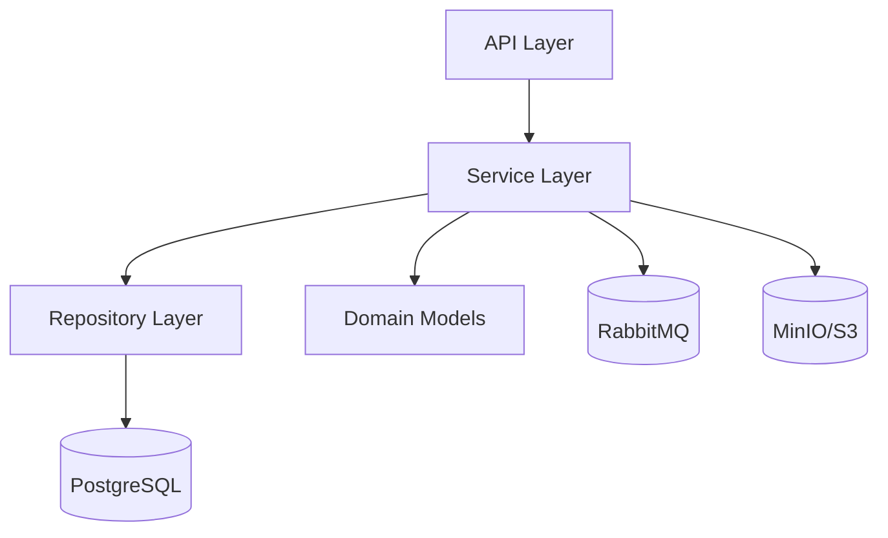

# ETAPA 5 — CLINICAL SERVICE (FASTAPI)

# 1. OBJETIVO

O `clinical-service` será responsável por:

* Prontuários médicos
* Prescrições
* Upload de exames
* Histórico clínico
* Timeline médica
* Auditoria
* Publicação de eventos
* Integração com armazenamento S3-compatible

---

# 2. RESPONSABILIDADES DO SERVIÇO

| Domínio         | Responsabilidade      |
| --------------- | --------------------- |
| Medical Records | Evolução clínica      |
| Prescriptions   | Receita médica        |
| Exams           | Uploads e metadados   |
| Timeline        | Histórico consolidado |
| Audit Trail     | Rastreamento          |
| Storage         | Arquivos PDF          |
| Events          | RabbitMQ              |

---

# 3. CLEAN ARCHITECTURE


# 4. ESTRUTURA DO PROJETO

```text
clinical-service/
├── app/
│
│   ├── api/
│   │   ├── router.py
│   │   └── v1/
│   │       ├── medical_record_routes.py
│   │       ├── prescription_routes.py
│   │       └── exam_routes.py
│   │
│   ├── core/
│   │   ├── config.py
│   │   ├── database.py
│   │   ├── security.py
│   │   └── logging.py
│   │
│   ├── domain/
│   │   ├── models/
│   │   │   ├── medical_record.py
│   │   │   ├── prescription.py
│   │   │   ├── exam.py
│   │   │   └── audit_log.py
│   │   │
│   │   └── enums/
│   │       ├── exam_type.py
│   │       └── medical_record_status.py
│   │
│   ├── schemas/
│   │   ├── medical_record_schema.py
│   │   ├── prescription_schema.py
│   │   ├── exam_schema.py
│   │   └── audit_schema.py
│   │
│   ├── repositories/
│   │   ├── medical_record_repository.py
│   │   ├── prescription_repository.py
│   │   ├── exam_repository.py
│   │   └── audit_repository.py
│   │
│   ├── services/
│   │   ├── medical_record_service.py
│   │   ├── prescription_service.py
│   │   ├── exam_service.py
│   │   ├── timeline_service.py
│   │   └── audit_service.py
│   │
│   ├── storage/
│   │   ├── s3_client.py
│   │   └── storage_service.py
│   │
│   ├── messaging/
│   │   ├── rabbitmq.py
│   │   ├── producer.py
│   │   ├── consumer.py
│   │   └── events.py
│   │
│   ├── middleware/
│   │   └── auth_middleware.py
│   │
│   └── main.py
│
├── uploads/
├── alembic/
├── Dockerfile
├── requirements.txt
├── docker-compose.yml
└── .env
```

---

# 5. REQUIREMENTS.TXT

```txt
fastapi
uvicorn[standard]

sqlalchemy
psycopg2-binary
alembic

pydantic
pydantic-settings

python-jose[cryptography]

python-multipart

boto3

pika

python-dotenv
```

---

# 6. CONFIGURAÇÃO

# app/core/config.py

```python
from pydantic_settings import BaseSettings


class Settings(BaseSettings):

    DATABASE_URL: str

    JWT_SECRET_KEY: str

    RABBITMQ_URL: str

    S3_ENDPOINT: str

    S3_ACCESS_KEY: str

    S3_SECRET_KEY: str

    S3_BUCKET: str

    class Config:
        env_file = ".env"


settings = Settings()
```

---

# 7. DATABASE

# app/core/database.py

```python
from sqlalchemy import create_engine

from sqlalchemy.orm import sessionmaker
from sqlalchemy.orm import declarative_base

from app.core.config import settings

engine = create_engine(settings.DATABASE_URL)

SessionLocal = sessionmaker(
    bind=engine,
    autocommit=False,
    autoflush=False
)

Base = declarative_base()


def get_db():
    db = SessionLocal()

    try:
        yield db

    finally:
        db.close()
```

---

# 8. MEDICAL RECORD MODEL

# app/domain/models/medical_record.py

```python
import uuid

from sqlalchemy import Column, String, Text, DateTime
from sqlalchemy.sql import func
from sqlalchemy.dialects.postgresql import UUID

from app.core.database import Base


class MedicalRecord(Base):
    __tablename__ = "medical_records"

    id = Column(UUID(as_uuid=True), primary_key=True, default=uuid.uuid4)
    appointment_id = Column(UUID(as_uuid=True), unique=True, nullable=False)
    patient_id = Column(UUID(as_uuid=True), nullable=False, index=True)
    doctor_id = Column(UUID(as_uuid=True), nullable=False, index=True)
    chief_complaint = Column(Text, nullable=False)
    anamnesis = Column(Text, nullable=True)
    physical_exam = Column(Text, nullable=True)
    diagnosis = Column(Text, nullable=True)
    diagnosis_codes = Column(Text, nullable=True)  # JSON array
    treatment_plan = Column(Text, nullable=True)
    observations = Column(Text, nullable=True)
    ai_analysis_id = Column(String(36), nullable=True)
    created_at = Column(DateTime(timezone=True), server_default=func.now())
    updated_at = Column(DateTime(timezone=True), server_default=func.now(), onupdate=func.now())
```


# 9. PRESCRIPTION MODEL

# app/domain/models/prescription.py

```python
import uuid

from sqlalchemy import Column
from sqlalchemy import Text
from sqlalchemy import DateTime

from sqlalchemy.sql import func

from sqlalchemy.dialects.postgresql import UUID

from app.core.database import Base


class Prescription(Base):
    __tablename__ = "prescriptions"

    id = Column(UUID(as_uuid=True), primary_key=True, default=uuid.uuid4)
    medical_record_id = Column(UUID(as_uuid=True), nullable=False)
    medication = Column(Text, nullable=False)
    dosage = Column(Text, nullable=False)
    instructions = Column(Text, nullable=False)
    created_at = Column(DateTime(timezone=True), server_default=func.now())
```

---

# 10. EXAM MODEL

# app/domain/models/exam.py

```python
import uuid

from sqlalchemy import Column
from sqlalchemy import String
from sqlalchemy import DateTime

from sqlalchemy.sql import func

from sqlalchemy.dialects.postgresql import UUID

from app.core.database import Base


class Exam(Base):

    __tablename__ = "exams"

    id = Column(
        UUID(as_uuid=True),
        primary_key=True,
        default=uuid.uuid4
    )

    medical_record_id = Column(
        UUID(as_uuid=True),
        nullable=False
    )

    exam_type = Column(String, nullable=False)

    file_url = Column(String, nullable=False)

    uploaded_by = Column(UUID(as_uuid=True))

    created_at = Column(
        DateTime(timezone=True),
        server_default=func.now()
    )
```

---

# 11. AUDIT LOG MODEL

# app/domain/models/audit_log.py

```python
import uuid

from sqlalchemy import Column, String, Text, DateTime, JSON
from sqlalchemy.sql import func
from sqlalchemy.dialects.postgresql import UUID

from app.core.database import Base


class AuditLog(Base):
    __tablename__ = "audit_logs"

    id = Column(UUID(as_uuid=True), primary_key=True, default=uuid.uuid4)
    operation = Column(String(50), nullable=False)
    entity_type = Column(String(100), nullable=False)
    entity_id = Column(String(36), nullable=False)
    user_id = Column(String(36), nullable=False)
    old_values = Column(JSON, nullable=True)
    new_values = Column(JSON, nullable=True)
    ip_address = Column(String(45), nullable=True)
    user_agent = Column(Text, nullable=True)
    status = Column(String(20), nullable=False, default="SUCCESS")
    error_reason = Column(Text, nullable=True)
    request_id = Column(String(36), nullable=True)
    timestamp = Column(DateTime(timezone=True), server_default=func.now())
    metadata = Column(JSON, nullable=True)
```
