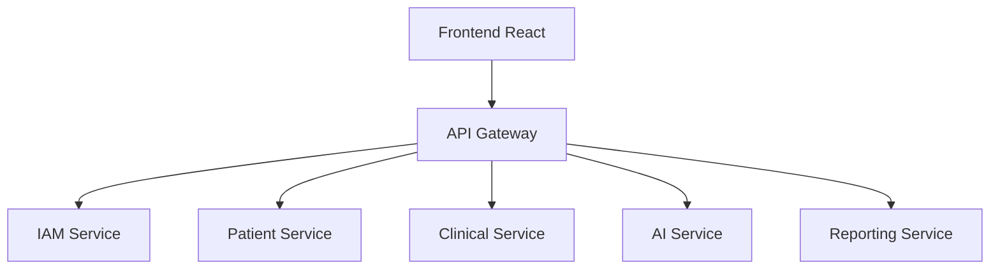

# ETAPA 8 — API GATEWAY

# 1. OBJETIVO

O `api-gateway` será o ponto central de entrada do ecossistema distribuído.

Responsabilidades:

* Central request routing
* JWT validation
* Authentication middleware
* Reverse proxy
* Rate limiting
* CORS
* Request aggregation
* Service discovery abstraction
* Security enforcement
* Observability hooks

---

# 2. ARQUITETURA DO GATEWAY



---

# 3. RESPONSABILIDADES

| Módulo             | Responsabilidade          |
| ------------------ | ------------------------- |
| Auth Middleware    | JWT validation            |
| Proxy Router       | Request forwarding        |
| Aggregation Layer  | Multi-service composition |
| Rate Limiter       | Throttling                |
| Service Registry   | Service discovery         |
| CORS Middleware    | Cross-origin policies     |
| Logging Middleware | Observability             |
| Error Middleware   | Unified responses         |

---

# 4. ESTRUTURA DO PROJETO

```text
api-gateway/
├── app/
│
│   ├── api/
│   │   ├── router.py
│   │   └── routes/
│   │       ├── auth_proxy.py
│   │       ├── patient_proxy.py
│   │       ├── clinical_proxy.py
│   │       ├── ai_proxy.py
│   │       └── reporting_proxy.py
│   │
│   ├── core/
│   │   ├── config.py
│   │   ├── security.py
│   │   ├── logging.py
│   │   
│   ├── middleware/
│   │   ├── auth_middleware.py
│   │   ├── logging_middleware.py
│   │   ├── error_middleware.py
│   │   
│   ├── services/
│   │   ├── proxy_service.py
│   │   └── discovery_service.py
│   │
│   
│   └── main.py
│
├── Dockerfile
├── requirements.txt
└── .env
```

---

# 5. REQUIREMENTS.TXT

```txt
fastapi
uvicorn[standard]

httpx

python-jose
python-dotenv

slowapi

pydantic
pydantic-settings
```

---

# 6. CONFIGURAÇÃO

# app/core/config.py

```python
from pydantic_settings import BaseSettings


class Settings(BaseSettings):

    IAM_SERVICE_URL: str

    PATIENT_SERVICE_URL: str

    CLINICAL_SERVICE_URL: str

    AI_SERVICE_URL: str

    REPORTING_SERVICE_URL: str

    JWT_SECRET: str

    JWT_ALGORITHM: str = "HS256"

    class Config:
        env_file = ".env"


settings = Settings()
```

---

# 7. SERVICE DISCOVERY ABSTRACTION

# app/services/discovery_service.py

```python
from app.core.config import settings


class DiscoveryService:

    SERVICES = {
        "iam": settings.IAM_SERVICE_URL,
        "patient": settings.PATIENT_SERVICE_URL,
        "clinical": settings.CLINICAL_SERVICE_URL,
        "ai": settings.AI_SERVICE_URL,
        "reporting": settings.REPORTING_SERVICE_URL
    }

    @classmethod
    def resolve(cls, service_name: str):

        return cls.SERVICES.get(service_name)
```

---

# 8. JWT VALIDATION

# app/core/security.py

```python
from jose import jwt
from jose import JWTError

from fastapi import HTTPException

from app.core.config import settings


def validate_token(token: str):

    try:

        payload = jwt.decode(
            token,
            settings.JWT_SECRET,
            algorithms=[settings.JWT_ALGORITHM]
        )

        return payload

    except JWTError:

                raise HTTPException(
                        status_code=401,
                        detail="Invalid token"
                )

---

# Detalhes de implementação (extraído do ambiente)

- **Host port mapping (host:container):** 8000:8000
- **Gateway routes (mapeamento principal):**
    - `/api/v1/auth/*` → `iam-service` (http://iam-service:8000)
    - `/api/v1/users/*` → `iam-service` (http://iam-service:8000)
    - `/api/v1/patients/*` → `patient-service` (http://patient-service:8000)
    - `/api/v1/appointments/*`, `/api/v1/records/*`, `/api/v1/schedules/*` → `clinical-service` (http://clinical-service:8000)
    - `/api/v1/ai/*` → `ai-service` (http://ai-service:8000)
    - `/api/v1/reports/*` → `reporting-service` (http://reporting-service:8000)
- **Health endpoints:**
    - Gateway: `/healthz`, Aggregate: `/healthz/services`
    - Downstream services: `/healthz`
- **Configurable via env:** `IAM_SERVICE_URL`, `PATIENT_SERVICE_URL`, `CLINICAL_SERVICE_URL`, `AI_SERVICE_URL`, `REPORTING_SERVICE_URL`, `JWT_SECRET_KEY` / `JWT_ALGORITHM`, `REDIS_URL`

Inclua estes detalhes nas secções de Quickstart e exemplos operacionais para garantir que os exemplos reflitam os nomes de serviço e portas do `docker-compose.yml`.

---

# Quickstart padronizado

```bash
curl http://localhost:8000/healthz
curl http://localhost:8000/healthz/services
curl http://localhost:8000/docs
```

O gateway publica os prefixos `/api/v1/auth`, `/api/v1/users`, `/api/v1/patients`, `/api/v1/appointments`, `/api/v1/records`, `/api/v1/schedules`, `/api/v1/ai` e `/api/v1/reports`.
```
